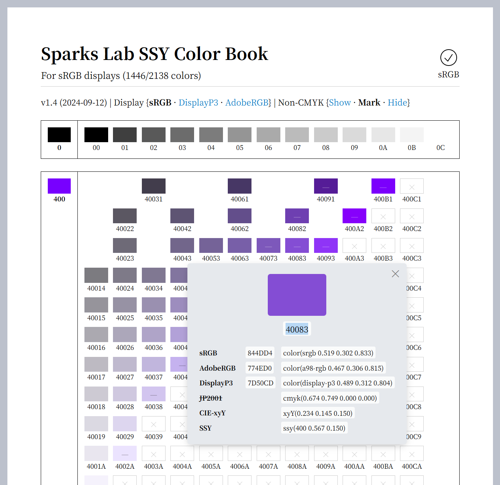
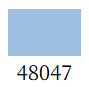
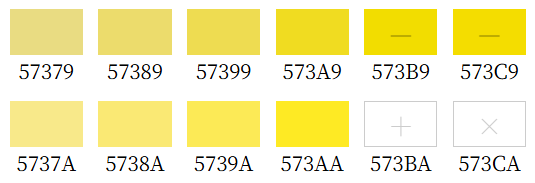
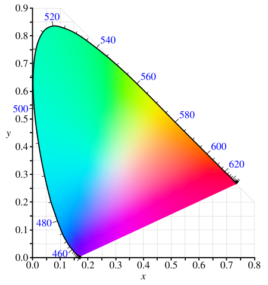

# Sparks Lab SSY Color Book

**English** | [简体中文](README_zh.md)

This is a homemade digital color book. It contains virtually all kinds of colors and aims to eliminate the hassle of manually formulating colors using the usually hard-to-use color picker when doing visual design.

<p></p>

> ⚠️ **Firefox does not have complete support for wide-gamut displays. If you use Firefox, please set your display to sRGB.**
>
> Chromium-based browsers will work correctly with a wide-gamut display as long as your display has the correct specifications in its ICC file.
>
> The color book uses CSS wide-gamut standards. If your browser support them, you can view whatever edition you want, but keep in mind that out-of-gamut colors will be inaccurate.

The repository contains code for generating the color book, not the color book itself. [View or save the color book here](https://sparkslab.art/colors/).

HEX RGB values are also [available for download here](https://sparkslab.art/colors/palette/).

## Brief instruction

### The color numbering system

The color number is basically based on HSV, but in a more device-independent and intuitive manner.

<p></p>

```plain
4 8 0 4 7
\___/ | |
  |   | ** perceptual brightness, ranging from 0 to C (12).
  |   ** saturation, ranging from 0 to C (12).
  ** hue, represented using the spectral wavelength (in nanometers).
```

Additional notes:

- The white point used in color computation is ALWAYS the D65 white point.
- Some hue values (like magenta) do not have a corresponding wavelength. They are represented with a mix ratio between 400nm (violet) and 700nm (red). For example, `L12` means 12% of violet and 88% of red mixed linearly.
- When saturation is `0`, hue becomes meaningless, hence should be omitted. For example, white should be represented with just `0C`, not `4000C` or `5600C`.
- When brightness is `0`, the color is nothing else but pure black. We define that the only valid way to represent black is `00`.
- The only possible color with a full brightness `C` on a display (or in a printer) is white `0C`, since it is not possible to create other colors without decreasing brightness.

### Color gamut indicators

<p></p>

| Indicator | Can display | Can reproduce with CMYK |
| - | - | - |
| ` ` | + | + |
| `—` | + | - |
| `＋` | - | + |
| `×` | - | - |

The CMYK standard used here is the widely-adapted JapanColor2001Coated standard, with white point adapted to D65.

## Principles

The color book is built according to the following principles:

1. The color set should not be opinionated. It should contain virtually ALL kinds of colors, including bright, dark, low-contrast and grayish ones (but not necessarily the MOST saturate possible colors).
2. Each color should have a not-too-long and easily memorable number. The scheme of the number should be reasonable and intuitive.
3. Each color must have a device-independent specification and RGB values for sRGB, DisplayP3 and AdobeRGB if applicable.
4. The total number of displayable colors in the book should be no more than 2400.

## Technical details

### From color number to SSY

The underlying color coordinates system used in this color book is a custom one called `SSY`. Take the `48047` color for example:

```plain
ssy(480 0.215 0.500)
    \_/ \___/ \___/
     |    |     |
     |    |     ** perceptual brightness, range [0, 1]
     |    ** saturation, range [0, 1]
     ** spectral wavelength, range [400, 700] ∪ [-1, -99]
// Note that negative wavelength correspond to the mix ratio
// between red and violet.
```

The calculation rules are:

```python
saturation = (saturation_digit / 12) ** 1.4

brightness_temp = brightness_digit - 2
if brightness_temp < 2:
  # Map the [-2, 2] range into [0, 2]
  brightness_temp = brightness_temp / 2 + 1
brightness = brightness_temp / 12
```

The rules are designed to give more space in the color book to dark or low-saturation colors.

### From SSY to RGB

<p></p>

Such coordinates is first converted into [CIE-xyY](https://en.wikipedia.org/wiki/CIE_1931_color_space#CIE_xy_chromaticity_diagram_and_the_CIE_xyY_color_space) coordinates. Take the above example:

1. First we find the point for wavelength 480nm on the xy chromaticity diagram. It is `xy(0.091 0.133)`.
2. Then we find the D65 white point `xy(0.313 0.329)`.
3. According to the saturation value `0.215`, mix 21.5% of 480nm and 78.5% of D65 to get the new xy coordinates `xy(0.265 0.287)`.
4. Construct CIE-xyY coord by copying the brightness value to `Y`. We get `xyY(0.265 0.287 0.500)`.

Assuming the white point is D65, we now convert it into sRGB and AdobeRGB coordinates. Those are done using `python-colormath`. Since the process involves only linear transformation and gamma correction, out-of-gamut values can be preserved as-is.

`python-colormath` does not support DisplayP3 natively. We obtain DisplayP3 values by converting sRGB values to it using the sRGB and DisplayP3's adaptation matricies. See [specsy.py](./specsy.py) for more details.

A color is considered undisplayable in a certain color space if any component of its RGB value exceeds the valid range `[0, 1]`.

### From SSY to CMYK (JapanColor2001)

First we convert CIE-xyY into CIE-xyz.

We use `littlecms` to convert CIE-xyz coordinates to JapanColor2001Coated CMYK under `perceptual` intent. Internally, this involves using a lookup table so that it is not easy to tell if a color is out of the CMYK gamut. We check this using the following steps:

1. Convert CIE-xyz coordinates to CMYK.
2. Convert CMYK coordinates back to CIE-xyz using the same lookup table.
3. Compare the obtained color with the original one. The color is considered unreproducible using CMYK if their [CMC delta E](https://en.wikipedia.org/wiki/Color_difference#CMC_l:c_(1984)) is not less than `3`.

### The chosen hue values

As we can see from the chromaticity diagram, colors distribute very unevenly across wavelengths. Currently, the wavelengths in the color book is hand-picked. See [main.py](main.py) for details.
